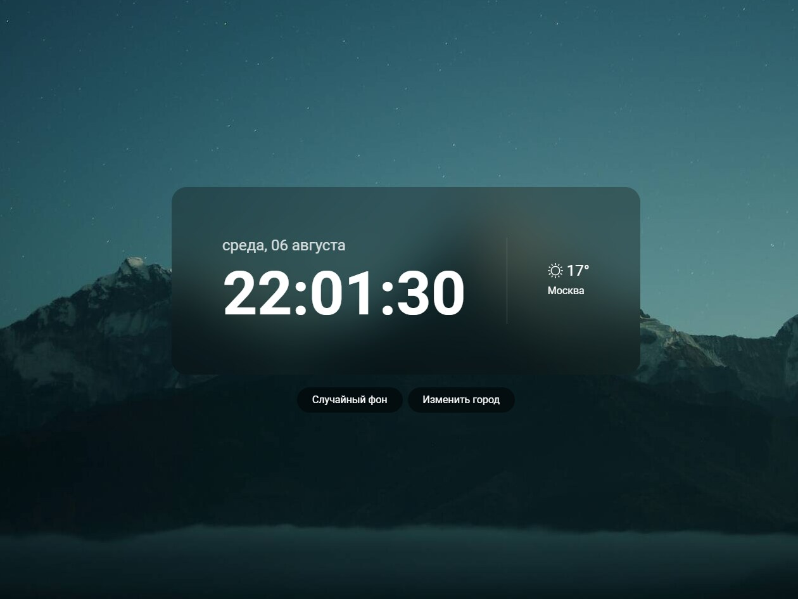

# TempoVista - Time & Weather Widget

A Single Page Application that displays the current time, date, and weather for a selected city, with dynamic wallpapers that change based on time of day or at random.

## Features

- **Time and Date** display for your region.
- **Weather Information** based on the selected city.
- **Dynamic Wallpapers** that adapt to the time of day.
- Option to **randomly pick** a wallpaper from the collection.

## Tech Stack

- **Language:** TypeScript (strict mode enabled, custom type definitions for API responses)
- **Framework/Library:** Vanilla JS with modular architecture
- **Bundler:** Vite (fast HMR, optimized build output)
- **Linting:** ESLint (with TypeScript plugin and Prettier integration)
- **APIs:** Open-Meteo for weather data

## Screenshot

